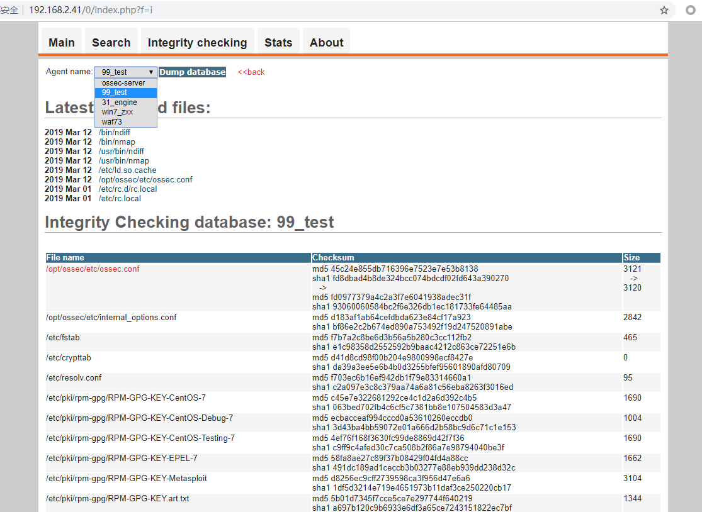

# 数据字典


## 数据库说明

> **名字和键值对都特别容易理解，见文生意，所以就不在后面额外解释字段了**

```
mysql root@localhost:ossec> show tables;                                                                                                                   
+----------------------------+-----------------------------+
| Tables_in_ossec            |
+----------------------------+-----------------------------+
| agent                      |
| alert                      |
| category                   |
| data                       |
| location                   |
| server                     |
| signature                  |
| signature_category_mapping |
+----------------------------+-----------------------------+
```


### agent 表格【客户端表】
```
mysql root@localhost:ossec> desc agent;                                                                                                                    
+--------------+----------------------+------+-----+---------+----------------+-----------------------------+
| Field        | Type                 | Null | Key | Default | Extra          |
+--------------+----------------------+------+-----+---------+----------------+-----------------------------+
| id           | smallint(5) unsigned | NO   | PRI | <null>  | auto_increment |
| server_id    | smallint(5) unsigned | NO   | PRI | <null>  |                |
| last_contact | int(10) unsigned     | NO   |     | <null>  |                |
| ip_address   | int(10) unsigned     | NO   |     | <null>  |                |
| version      | varchar(32)          | NO   |     | <null>  |                |
| name         | varchar(64)          | NO   |     | <null>  |                |
| information  | varchar(128)         | NO   |     | <null>  |                |
+--------------+----------------------+------+-----+---------+----------------+-----------------------------+
7 rows in set
Time: 0.035s
```

## alert 表格【日志表】
```
mysql root@localhost:ossec> desc alert;'                                                                                                                   
+-------------+-----------------------+------+-----+---------+-------+-----------------------------+
| Field       | Type                  | Null | Key | Default | Extra |
+-------------+-----------------------+------+-----+---------+-------+-----------------------------+
| id          | int(10) unsigned      | NO   | PRI | <null>  |       |
| server_id   | smallint(5) unsigned  | NO   | PRI | <null>  |       |
| rule_id     | mediumint(8) unsigned | NO   | MUL | <null>  |       |
| timestamp   | int(10) unsigned      | NO   | MUL | <null>  |       |
| location_id | smallint(5) unsigned  | NO   |     | <null>  |       |
| src_ip      | int(10) unsigned      | YES  | MUL | <null>  |       |
| dst_ip      | int(10) unsigned      | YES  |     | <null>  |       |
| src_port    | smallint(5) unsigned  | YES  |     | <null>  |       |
| dst_port    | smallint(5) unsigned  | YES  |     | <null>  |       |
| alertid     | tinytext              | YES  |     | <null>  |       |
+-------------+-----------------------+------+-----+---------+-------+-----------------------------+
10 rows in set
```

## category 表格【分类表】
```
mysql root@localhost:ossec> desc category                                                                                                                  
+----------+----------------------+------+-----+---------+----------------+-----------------------------+
| Field    | Type                 | Null | Key | Default | Extra          |
+----------+----------------------+------+-----+---------+----------------+-----------------------------+
| cat_id   | smallint(5) unsigned | NO   | PRI | <null>  | auto_increment |
| cat_name | varchar(32)          | NO   | UNI | <null>  |                |
+----------+----------------------+------+-----+---------+----------------+-----------------------------+
```

## data 表格【数据日志表】
```
mysql root@localhost:ossec> desc data;                                                                                                                     
+-----------+----------------------+------+-----+-------------------+-----------------------------+-----------------------------+
| Field     | Type                 | Null | Key | Default           | Extra                       |
+-----------+----------------------+------+-----+-------------------+-----------------------------+-----------------------------+
| id        | int(10) unsigned     | NO   | PRI | <null>            |                             |
| server_id | smallint(5) unsigned | NO   | PRI | <null>            |                             |
| user      | text                 | NO   |     | <null>            |                             |
| full_log  | text                 | NO   |     | <null>            |                             |
| timestamp | timestamp            | NO   | MUL | CURRENT_TIMESTAMP | on update CURRENT_TIMESTAMP |
+-----------+----------------------+------+-----+-------------------+-----------------------------+-----------------------------+
5 rows in set
```

## location 表格【主机位置表】
```
mysql root@localhost:ossec> desc location;                                                                                                                 
+-----------+----------------------+------+-----+---------+----------------++----------------------+
| Field     | Type                 | Null | Key | Default | Extra          |
+-----------+----------------------+------+-----+---------+----------------++----------------------+
| id        | smallint(5) unsigned | NO   | PRI | <null>  | auto_increment |
| server_id | smallint(5) unsigned | NO   | PRI | <null>  |                |
| name      | varchar(128)         | NO   |     | <null>  |                |
+-----------+----------------------+------+-----+---------+----------------++----------------------+
3 rows in set
```

## server 表格【服务主机表】
```
mysql root@localhost:ossec> desc server;                                                                                                                   
+--------------+----------------------+------+-----+---------+----------------+
| Field        | Type                 | Null | Key | Default | Extra          |
+--------------+----------------------+------+-----+---------+----------------+
| id           | smallint(5) unsigned | NO   | PRI | <null>  | auto_increment |
| last_contact | int(10) unsigned     | NO   |     | <null>  |                |
| version      | varchar(32)          | NO   |     | <null>  |                |
| hostname     | varchar(64)          | NO   | UNI | <null>  |                |
| information  | varchar(128)         | NO   |     | <null>  |                |
+--------------+----------------------+------+-----+---------+----------------+
```

## signature 表格【特征表】
```
mysql root@localhost:ossec> desc signature;                                                                                                                
+-------------+-----------------------+------+-----+---------+----------------+
| Field       | Type                  | Null | Key | Default | Extra          |
+-------------+-----------------------+------+-----+---------+----------------+
| id          | smallint(5) unsigned  | NO   | PRI | <null>  | auto_increment |
| rule_id     | mediumint(8) unsigned | NO   | UNI | <null>  |                |
| level       | tinyint(3) unsigned   | YES  | MUL | <null>  |                |
| description | varchar(255)          | NO   |     | <null>  |                |
+-------------+-----------------------+------+-----+---------+----------------+
4 rows in set
```

## 规则ID和分类的映射表
```
mysql root@localhost:ossec> desc signature_category_mapping;                                                                                               
+---------+-----------------------+------+-----+---------+----------------+
| Field   | Type                  | Null | Key | Default | Extra          |
+---------+-----------------------+------+-----+---------+----------------+
| id      | smallint(5) unsigned  | NO   | PRI | <null>  | auto_increment |
| rule_id | mediumint(8) unsigned | NO   | PRI | <null>  |                |
| cat_id  | smallint(5) unsigned  | NO   | PRI | <null>  |                |
+---------+-----------------------+------+-----+---------+----------------+
3 rows in set
```

## 查看规则详情
```sql
SELECT
	t.*,
	category.cat_name 
FROM
	( SELECT signature.rule_id, LEVEL, description, cat_id FROM signature LEFT JOIN signature_category_mapping ON signature_category_mapping.rule_id = signature.rule_id ) AS t
	LEFT JOIN category ON category.cat_id = t.cat_id;
```


- 查看规则数量

```sql
SELECT
	count( * ) 
FROM
	(
SELECT
	t.*,
	category.cat_name 
FROM
	( SELECT signature.rule_id, LEVEL, description, cat_id FROM signature LEFT JOIN signature_category_mapping ON signature_category_mapping.rule_id = signature.rule_id ) AS t
	LEFT JOIN category ON category.cat_id = t.cat_id 
	) AS t2;
```

- 日志7表合1

```sql
SELECT
	cat_name,
	LEVEL,
	description,
	src_ip,
	dst_ip,
	src_port,
	dst_port,
	hostname,
	location,
	FROM_UNIXTIME( TIMESTAMP, '%Y年%m月%d %r' ) AS dt,
	rule_id 
FROM
	(
SELECT
	alert_rule.*,
	SERVER.hostname,
	SERVER.NAME AS location 
FROM
	(
SELECT
	regular.cat_name,
	regular.LEVEL,
	regular.description,
	alert.* 
FROM
	alert
	LEFT JOIN (
SELECT
	t.*,
	category.cat_name 
FROM
	( SELECT signature.rule_id, LEVEL, description, cat_id FROM signature LEFT JOIN signature_category_mapping ON signature_category_mapping.rule_id = signature.rule_id ) AS t
	LEFT JOIN category ON category.cat_id = t.cat_id 
	) AS regular ON regular.rule_id = alert.rule_id 
	) AS alert_rule
	LEFT JOIN ( SELECT location.NAME, SERVER.hostname, SERVER.id FROM SERVER LEFT JOIN location ON SERVER.id = location.server_id ) AS SERVER ON SERVER.id = alert_rule.server_id 
	) AS user_alert 
ORDER BY
TIMESTAMP DESC 
	LIMIT 2;
```

## ossec-ui-0.9查看示例 
